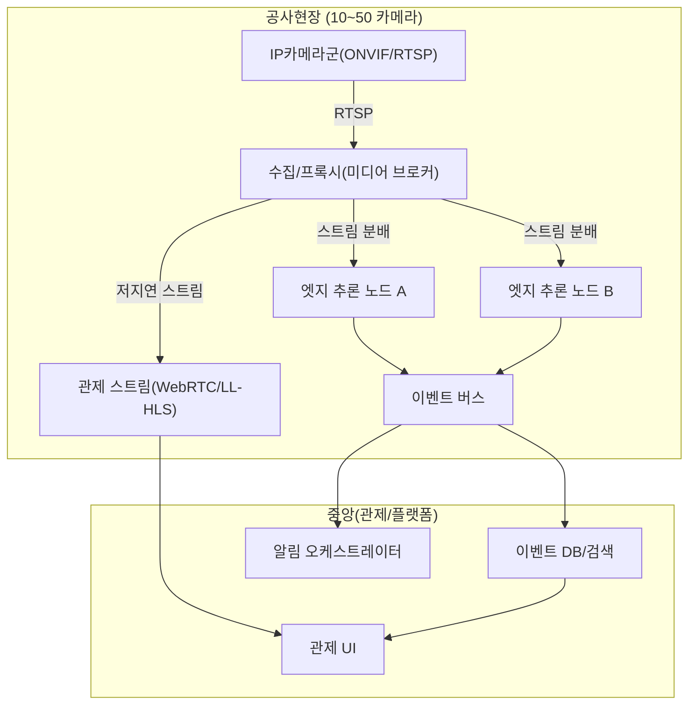
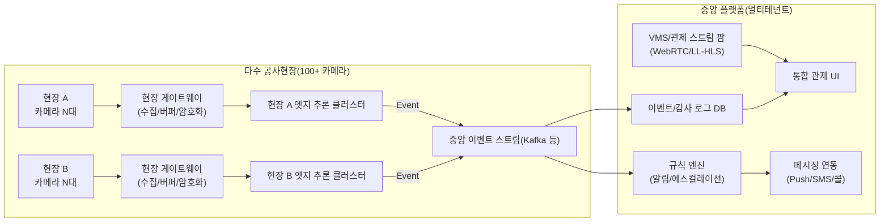

# 공사현장 실시간 모니터링 시스템을 빠르고 쉽게 구축하는 방법

## Executive Summary

공사현장 “실시간 모니터링(중앙 관제 + 실시간 알림)”을 **가장 빠르게** 상용화 수준으로 올리는 방법은, 영상 인프라(카메라/VMS)와 안전 AI(안전장비·쓰러짐 감지)를 **직접 조합·개발하기보다 ‘검증된 기성(상용/오픈소스) 구성요소’를 최대 활용**해 “현장 기준(시야·조도·네트워크)”을 맞추는 접근이다. 특히 **안전모·안전조끼(일부 PPE) + 쓰러짐(슬립/낙상 유사 이벤트) 감지**는 이미 상용 카메라/분석앱 또는 관리형 비전 서비스에서 제공되는 경우가 있어, PoC→파일럿→상용 전환 속도에서 큰 차이가 난다. citeturn10search17turn22view0turn6search1

본 보고서는 사용자가 명시한 요구사항(웹캠/RTSP 영상 수집, PPE 착용 체크, 쓰러짐 감지, 중앙 관제/알림, 오픈소스·상용 API 활용, 상용화 수준, 기존 솔루션 최대 활용)을 충족하기 위해 다음과 같은 “현실적인 결론”을 제시한다.

- **가장 빠른 구축(현장 적용 중심)**: AI 기능이 이미 검증된 **AI 카메라/앱 + VMS**(또는 안전 특화 SaaS)를 우선 검토한다. 예: 쓰러짐 감지를 “객체 추적 + 자세 분류”로 구현하며, 설치 조건(설치 높이·각도·조도·ROI 내 인원수 등)을 가이드로 제공하는 상용 솔루션은 **현장 튜닝 리스크를 감소**시킨다. citeturn18view3turn18view4turn10search2turn6search1  
- **저비용/유연성(벤더 종속 최소화)**: ONVIF/RTSP 카메라 + 오픈소스 NVR/미디어 서버 + 엣지 추론(오픈소스 모델) 조합이 유리하나, **장갑 감지(소형 객체)**처럼 난도가 높은 항목은 카메라 배치(근접/게이트형)와 데이터 구축이 성패를 가른다. citeturn12search0turn2search20turn3search20turn5search7  
- **고신뢰/대규모(100+ 카메라)**: 네트워크 품질이 혼합(유선+무선)이고 대규모로 갈수록, (1) **엣지에서 1차 추론 + 이벤트/메타데이터만 상향**, (2) 중앙은 **멀티테넌트 관제·감사로그·권한·알림 오케스트레이션**에 집중하는 아키텍처가 운영 안정성과 개인정보 리스크를 동시에 낮춘다. citeturn20view1turn16search7turn24view0

또한 한국 환경에서는 영상이 “개인영상정보”로 다뤄질 가능성이 높으므로, 고정형 CCTV 설치·운영은 **「개인정보 보호법」 제25조**의 허용 사유(예: 시설 안전·관리, 화재 예방 등) 범위에서 목적·범위를 최소화하고, 안내판/운영·관리방침/보관·파기/접근통제/암호화 등 보호조치를 체계화해야 한다. citeturn16search4turn16search7turn20view0turn20view1turn18view2

---

## 구현 옵션 비교

아래 비교는 “신규 개발 최소화”를 원칙으로, **완전 상용형**, **하이브리드(상용 API/관리형 비전 + 오픈소스)**, **자체 오픈소스 스택** 3가지를 같은 요구사항(PPE·쓰러짐·관제·알림) 관점에서 비교한 것이다.

| 구분 | 대표 접근 | 장점 | 단점/리스크 | 예상 구축·개발 기간(현실적 범위) | 필요 인력(운영 포함) | 비용 범위(대략) | 확장성/유지보수 |
|---|---|---|---|---|---|---|---|
| 완전 상용 SaaS/기성 솔루션 | 안전 특화 CV SaaS(기존 CCTV 연동) 또는 클라우드 관리형 카메라/VMS | “며칠~수주” 단위로 현장 적용 가능(모델·관제·알림이 패키지) | 벤더 종속, 커스터마이징 한계, 데이터 주권/국외 이전 이슈 가능 | **가장 빠름**: 기능 활성화 기준 “days” 주장 사례 존재 citeturn6search1 | 1~2명으로도 운영 가능(관제 담당 별도) | 카메라 HW + 라이선스(대개 견적). 일부 업체는 HW/라이선스 가격 공개 citeturn6search3turn6search4 | 확장 쉬우나 비용이 카메라 수에 비례. 벤더 SLA/지원에 의존 |
| 하이브리드 (상용 API/관리형 비전 + 오픈소스) | RTSP/웹캠 수집 + 오픈소스 스트리밍 + 상용 비전(예: PPE·블러) + 자체 관제/알림 | 초기 PoC 빠름, 특정 기능(PPE/블러)만 상용으로 가져와 리스크 감소 | 상용 비전 비용 구조를 잘못 잡으면 OPEX 폭증(특히 “프레임 단위 API 호출”) | PoC 4~8주, 파일럿 2~4개월(현장 튜닝 포함) | 2~5명(백엔드/영상/ML/프론트/DevOps) | 상용 분석이 “분당/스트림당 과금”인 경우 예측 가능 citeturn22view0 | 구성요소가 분리되어 장애 지점이 늘 수 있음. 대신 교체 가능성↑ |
| 자체 오픈소스 스택(최소 상용) | ONVIF/RTSP + 오픈소스 NVR/미디어 서버 + 엣지 추론(오픈소스 모델) + 자체 관제/알림 | 락인 최소, 데이터·보안 통제 용이, 장기적으로 TCO 유리 가능 | 모델 품질·데이터 구축·운영 난도↑. 상용화까지 품질/감사/보안 체계 구축 필요 | PoC 6~10주, 상용 4~9개월(요구정밀도·현장 수에 따라) | 3~8명(ML/MLOps/영상/플랫폼/QA/보안) | CAPEX↑(엣지·서버), OPEX↓ 가능 | 대규모 확장 가능하나 운영 역량이 핵심 병목 |

### “상용 수준” 관점에서 가장 흔한 실패 요인

- **장갑 감지**: 안전모/조끼 대비 객체가 작고 가림(occlusion)이 잦아, 원거리 광각 CCTV로 “항상 정확”을 기대하기 어렵다. 이 요구사항은 **카메라를 ‘게이트/출입구/작업대’ 같은 근거리 지점에 추가 배치**하거나, “글러브 착용이 결정적 리스크인 공정”만 ROI를 좁혀 적용하는 방식이 상용화에 유리하다(구축 방식 선택보다 카메라 설계가 중요). citeturn6search5turn18view3  
- **낙상(쓰러짐) 감지 정의**: 영상 기반 쓰러짐(슬립/폴) 감지는 “넘어짐” 전체를 커버하기보다, 보통 **서 있거나 걷는 중의 갑작스러운 쓰러짐**에 최적화되며, 설치 각도·조도·ROI 내 인원 수·가림에 성능이 크게 좌우된다. 기성 백서/가이드가 이 한계를 명시하는 경우가 많다. citeturn18view3turn18view4  
- **클라우드 비전 비용 구조**: “이미지당 과금” API를 영상에 그대로 적용하면(예: 1fps만 해도 월 수백만 이미지) 비용이 급격히 커질 수 있다. 반대로 “스트림당 월정액” 또는 “분당 과금” 모델은 예측 가능성이 높다. citeturn21view0turn22view0

---

## 핵심 기술 구성요소

### 영상 수집

- **입력 소스 유형**
  - USB 웹캠: PoC에 가장 빠르며, 엣지 디바이스에 직접 연결해 지연과 비용을 줄이기 좋다.
  - IP 카메라(네트워크 카메라): 현장 규모가 커질수록 표준적 선택. ONVIF는 IP 기반 물리보안 제품의 상호운용 표준이며, Profile S는 IP 네트워크에서 비디오 스트리밍을 요청·제어하는 기능을 정의한다. citeturn12search1turn12search0  
  - RTSP: 영상 제어/스트리밍에 널리 쓰이는 프로토콜로, IETF 표준(RFC 7826)로 정의된다. citeturn2search20

### 스트리밍/전송(프로토콜) 선택

- **현장→엣지(로컬 LAN)**: RTSP(가능하면 TCP interleaved)로 안정적으로 수집하고, 엣지에서 디코딩/추론/저지연 변환을 수행하는 구성이 일반적이다. citeturn2search20turn24view0  
- **엣지→중앙(혼합망/장거리)**:  
  - WebRTC: 브라우저 기반 저지연 모니터링에 유리하며, 실시간 통신을 위한 표준 스펙이 존재한다. citeturn2search21  
  - LL-HLS: 다수 시청자(관제 화면 다중 타일)에 유리하나, 지연이 WebRTC 대비 커질 수 있다. Apple은 Low-Latency HLS를 명시적으로 다룬다. citeturn2search23turn2search19  
  - SRT: 불안정한 네트워크에서 신뢰성 있는 전송을 목표로 하는 오픈소스 프로토콜로, 현장 무선망에서 고려 가치가 있다. citeturn2search9  

### 실시간 추론 위치: 엣지 vs 클라우드

- **엣지 추론(권장 기본값)**: 지연/망 장애/개인정보 리스크를 줄이는 데 유리. 특히 “현장 무선망”이 섞이면, **엣지에서 이벤트만 전송**하고 영상은 필요 시에만 중앙으로 보내는 패턴이 운영 안정성을 높인다. citeturn20view1turn24view0  
- **클라우드 추론(부분 적용)**: “PPE/블러 같은 기성 모델”을 빠르게 붙이거나, 중앙 집계(분석/리포팅)를 쉽게 만들 수 있다. 다만 데이터 저장·처리 위치(리전/물리적 저장) 제한이 있는 서비스도 있으므로, 한국 현장에서는 서비스 약관/지원 리전/데이터 레지던시 조건을 반드시 확인해야 한다. 예를 들어 특정 관리형 비전 서비스는 지원 리전이 제한되어 있고, 규제/준수 요구가 있을 경우 사용을 권고하지 않는다고 명시한다. citeturn23search16turn22view0  

### 모델/라이브러리 추천

요구사항을 “안전장비 착용(안전모·장갑 등) + 쓰러짐(낙상/슬립) 감지”로 분해해 추천한다.

- **PPE(안전모·조끼·장갑)**
  - 관리형 비전(빠른 구축): 영상 스트림 단위로 PPE 감지를 제공하고(분당 과금 또는 스트림당 월정액), 개인/얼굴 블러 같은 프라이버시 기능도 함께 제공하는 서비스가 있다. citeturn22view0  
  - 상용 현장형(빠른 구축, 한국 적합성): 일부 카메라/앱 생태계는 “쓰러짐 감지, PPE 준수(헬멧 등)”을 포함한 안전 기능과 대시보드를 제공하는 사례가 보고된다. citeturn10search8turn10search12turn10search17  
  - 오픈소스 모델(저비용/커스터м): YOLO 계열 또는 MMDetection 계열로 PPE 객체 탐지를 학습/추론하는 방식이 많다. 다만 **라이선스**가 상용화 리스크가 될 수 있다. 예: entity["company","Ultralytics","computer vision company"] YOLO는 저장소에 AGPL-3.0을 명시하고, 상용 비공개 배포를 원하면 별도 엔터프라이즈 라이선스를 안내한다. citeturn4search0turn4search3  
    - 상용화 리스크를 낮추려면 Apache 2.0 계열 스택(예: entity["organization","OpenMMLab","open source cv org"] MMDetection/MMPose, YOLOX)을 검토하는 편이 안전하다. citeturn5search2turn5search1turn5search3  
- **쓰러짐(낙상) 감지**
  - 기성 영상 분석(빠름): “객체 추적 + 자세 분류” 조합으로 쓰러짐을 인식하고, 설치 높이/각도/조도 조건 및 성능 한계를 가이드로 제시하는 접근은 현장 구축 난도를 낮춘다. citeturn18view3turn18view4  
  - 오픈소스/학술 기반(커스터м): 포즈 추정(스켈레톤 키포인트) 후 시계열 분류(LSTM/GRU 등)로 낙상을 판별하는 연구가 축적돼 있다. 예를 들어 UP-Fall 같은 데이터셋은 멀티모달(웨어러블·환경·비전) 기반 낙상 연구 비교를 목적으로 공개됐다. citeturn25search1  
  - 구현 난이도를 낮추는 포즈 추정 라이브러리
    - MoveNet: 17개 키포인트를 검출하는 모델(Lightning/Thunder 변형)로 실시간 적용을 강조한다. citeturn4search1  
    - MediaPipe Pose: RGB 입력에서 33개 랜드마크 기반의 포즈 추정을 제공하며, 프로젝트는 Apache 2.0 라이선스다. citeturn4search10turn5search0  

image_group{"layout":"carousel","aspect_ratio":"16:9","query":["construction site PPE detection bounding box example","construction site safety monitoring dashboard CCTV","fall detection video analytics alert screenshot"],"num_per_query":1}

---

## 규모별 아키텍처 예시

아래는 “웹캠/RTSP 영상 수집 → 실시간 추론 → 중앙 관제 → 실시간 알림”을 공통 흐름으로 두고, 규모별로 **병목 지점(네트워크/연산/저장/관제 동시접속)**을 다르게 해소하는 예시다. (Mermaid 다이어그램은 “데이터 흐름 중심”으로 제시)

### 소규모 현장

- 특징: 카메라 1~5대, 현장 내 1대의 엣지 박스로 대부분 처리
- 권장: 엣지에서 추론+기본 저장+간단 관제 → 이벤트만 클라우드/본사로 전달

```mermaid
flowchart LR
  subgraph Site["공사현장 (1~5 카메라)"]
    C1["USB 웹캠/IP카메라 (RTSP)"] -->|RTSP/USB| E1["엣지 박스\n(디코딩+추론+저장)"]
    E1 -->|이벤트(메타데이터)| MQ1["이벤트 브로커(MQTT/HTTP)"]
    E1 -->|라이브 변환(WebRTC/LL-HLS)| V1["관제 스트림 게이트웨이"]
  end

  subgraph Center["중앙/본사"]
    DASH["관제 대시보드(멀티카메라+이벤트 타임라인)"]
    ALERT["알림 서비스\n(Push/SMS/콜)"]
    DB["이벤트 DB"]
  end

  MQ1 --> DB --> DASH
  V1 --> DASH
  MQ1 --> ALERT
```

- “스트림 게이트웨이”는 RTSP를 WebRTC/LL-HLS로 변환해 브라우저 관제를 가능하게 한다(프로토콜 선택은 저지연/동시 시청자 수에 따라). citeturn2search21turn2search23  

### 중규모 현장

- 특징: 카메라 10~50대, 채널 수 증가로 디코딩/추론 부하가 커지고, 관제 동시 시청자도 늘어남
- 권장: 현장 내 “엣지 노드(다수)” + 중앙 “관제/알림/DB” 분리, 장애 격리



- “미디어 브로커(프록시)”는 RTSP/RTMP/WebRTC/HLS 등을 중계·변환해 주는 형태가 많고, 오픈소스 미디어 서버(예: MediaMTX)의 목적이 바로 다중 프로토콜 지원 및 프록시/레코딩이다. citeturn3search20turn3search33  

### 대규모 현장

- 특징: 100+ 카메라, 복수 현장/복수 망, 운영·보안·권한·감사로그·SLA가 핵심
- 권장: “현장 엣지에서 이벤트 중심” + 중앙은 멀티테넌트 플랫폼화. 저장은 “필요 최소 보관” 원칙을 따르되, 사고 클립은 장기 보관 정책을 별도로 둘 수 있음(법적 분쟁 대비). citeturn18view2turn20view1  



- 대규모에서 중요한 것은 “영상 자체”가 아니라 **안전 이벤트의 신뢰도(정확도·지연·재현성)**와 **감사 가능성(로그/접근기록/재현)**이다. 개인정보보호 관점에서도 “원본 영상 최소/이벤트 중심”은 목적 제한과 보관 최소화 원칙에 부합하기 쉽다. citeturn20view1turn18view2turn16search7  

---

## PoC 단계별 실행계획과 일정

명시된 미지정 사항(예산·규모·망·보관기간)은 PoC에서 빠르게 “현장 데이터”로 좁혀야 한다. PoC는 **정확도 검증 이전에 ‘설치/전송/관제/알림이 끊김 없이 돌아가는가’**를 먼저 통과하는 일정이 효율적이다.

### 주 단위 일정 예시

- **1주차**: 요구사항 고정(필수 PPE 품목 정의: 안전모/장갑/조끼 등), 카메라 설치 위치 설계(장갑은 근접 카메라 필요 여부 판단), 개인정보 문서 초안(안내판/운영·관리방침/권한체계) 착수 citeturn20view0turn16search7  
- **2주차**: 카메라/웹캠 설치, RTSP/USB 수집 파이프라인 구축, 관제 UI에 “라이브 타일” 띄우기(WebRTC 또는 LL-HLS 선택) citeturn2search21turn2search23turn2search20  
- **3주차**: PPE 1차 모델 연결(기성 또는 오픈소스), 이벤트 생성(“미착용” 규칙), 이벤트 DB/타임라인 표시 citeturn22view0turn5search7turn5search2  
- **4주차**: 쓰러짐 감지 연결(기성 또는 포즈+분류), 현장 조건(조도/각도/ROI) 튜닝, 오탐/미탐 샘플 수집 citeturn18view3turn18view4turn4search1turn25search1  
- **5주차**: 실시간 알림(모바일 Push/SMS/알림톡) 연동, 에스컬레이션(미확인 시 재알림/콜) 규칙 추가 citeturn8search0turn8search2turn8search3  
- **6주차**: 운영/보안(접근통제·암호화·감사로그·보관/파기 자동화) 적용 + 현장 UAT, KPI(정확도/지연/알림도달률) 리포트 citeturn20view1turn18view2turn16search7  

### PoC에 필요한 HW/SW 목록(권장)

**카메라 사양(권장 기준)**  
- IP 카메라는 ONVIF Profile S/RTSP 지원 여부를 우선 확인(서드파티 VMS/분석 파이프라인 연결성 확보). citeturn12search0turn12search1  
- 쓰러짐 감지는 설치 각도/높이/조도에 민감하므로, PoC 단계에서 최소한의 설치 가이드(예: 측면 시야 선호, 조도 300 lux 이상 등)를 충족하는 배치를 권장한다. citeturn18view3turn18view4  

**엣지 디바이스(권장)**  
- PoC/소규모: 저비용 GPU 엣지 키트(예: Jetson 계열)는 가격/성능이 명확히 공개돼 계획 수립이 쉽다(예: $249 언급). citeturn11search0turn11search1  
- 중~대규모: 멀티 스트림 디코딩+추론 파이프라인을 빠르게 구축하려면, 스트리밍 분석 툴킷(예: DeepStream) 기반이 운영 효율이 높다(멀티카메라 트래킹/메시지 브로커/플러그인 생태계 등). citeturn24view0  

**서버/클라우드(선택지)**  
- 관리형 비전 PPE/블러: 스트림 기반 과금 테이블이 공개된 서비스는 비용 예측이 비교적 쉽다. citeturn22view0  
- AWS 기반 스트리밍: Kinesis Video Streams(WebRTC 포함) 지원 리전(Seoul 포함)과 Rekognition(Seoul 제공) 정보를 기반으로 “국내 리전 처리” 설계를 할 수 있다. citeturn23search3turn23search2turn7search9  

### PoC 비용(범위) 예시

아래는 “장비 구매 + 최소 클라우드 사용” 기준의 거친 범위(부가세/시공/케이블/방수 하우징 제외)다. 실제 비용은 카메라 등급(실외 방진방수, 야간 IR), 저장기간, 관제 동시접속 수, 알림 채널(SMS/콜) 등에 크게 좌우된다.

| 항목 | 소규모(1~5ch) | 중규모(10~50ch) | 대규모(100ch+) | 근거/비고 |
|---|---:|---:|---:|---|
| 카메라/웹캠 | 저가 USB~산업용 IP 혼합 | IP 카메라 중심 | IP 카메라 + 일부 AI 카메라 혼합 | ONVIF/RTSP 연동성 우선 citeturn12search0turn2search20 |
| 엣지 디바이스 | 1대(또는 2대 이중화) | 현장 분산(2~6대+) | 현장별 클러스터 + 예비기 | 저가 엣지 키트 가격 공개 사례 citeturn11search0turn11search1 |
| 중앙 서버/스토리지 | 미니 서버 또는 NAS | DB/이벤트/관제 서버 + 스토리지 | 멀티테넌트 플랫폼 + 오브젝트 스토리지 | 보관·파기 자동화 필요 citeturn18view2turn20view1 |
| 비전 분석(클라우드) | 선택(월정액/분당) | 선택(스트림당 과금이 예측 용이) | 선택(데이터 레지던시 검토 필수) | 스트림당 월정액/분당 과금 표 citeturn22view0turn23search16 |
| 총합(대략, KRW 환산 전) | 수십~수백만 원대부터 시작 가능(구성 따라 상이) | 수백만~수천만 원대 | 수천만~수억 원대 | “벤더/설치 조건”에 따라 변동(본 보고서 추정) |

---

## 알림·대시보드 구현 옵션과 통합

### 중앙 모니터링 화면(관제)

구축 속도를 최우선으로 하면 “VMS를 관제의 중심”으로 두는 것이 정석이다. VMS는 다수 카메라의 라이브/재생/권한/감사 기능을 이미 제공하고, 분석 이벤트를 플러그인 또는 외부 시스템 알람으로 받아 표출하기 쉽다. 예를 들어 VMS가 ‘오픈 플랫폼’과 통합을 강조하는 경우가 있다. citeturn10search2  

- VMS 연동형(상용): 플러그인/SDK로 영상 스트림을 가져와 분석 시스템에 전달하는 접근이 가능하며(예: Media SDK가 비디오 데이터 접근을 위한 객체를 제공), “관제 UI는 VMS 그대로” 두고 이벤트만 붙이는 방식이 현장에서 가장 선호된다. citeturn10search3  
- 자체 Web UI(빠른 커스터마이징): 브라우저에서 WebRTC/LL-HLS로 타일을 구성하고, 이벤트 타임라인·맵·작업구역(ROI)별 위반 통계를 붙인다. 프로토콜 선택은 저지연 vs 동시접속 수 균형으로 결정한다. citeturn2search21turn2search23  

### 실시간 알림 채널

- Push(모바일/웹): FCM은 크로스 플랫폼 메시징으로 서버→클라이언트 알림을 지원한다. citeturn8search0turn8search8  
- SMS/알림톡(한국 친화): entity["company","네이버 클라우드 플랫폼","korean cloud provider"] SENS는 SMS/알림톡 등을 REST API로 제공한다고 설명한다. citeturn8search2turn8search18  
- 카카오 알림톡: entity["company","카카오","korean tech company"] 비즈 가이드는 알림톡이 “채널 추가 없이도 발송 가능한 정보성 메시지”이며 템플릿 심사 등 제약을 명시한다(안전 알림은 정보성 메시지로 설계 필요). citeturn8search3turn8search31  
- 글로벌 SMS/콜 연동: entity["company","Twilio","cpaaS company"] 는 Programmable Messaging 문서에서 SMS 등을 단일 API로 전송하는 방법을 안내한다. citeturn8search1turn8search13  

통합 설계 권고: “추론 → 이벤트 → 규칙 엔진 → 알림 채널”을 분리해, 카메라 수가 증가해도 알림 구현을 한 번만 바꾸면 되도록 한다(예: 알림 채널은 플러그인 형태).

---

## 개인정보·법적 고려사항

### 한국 법규의 핵심 포인트

- 공개된 장소의 고정형 CCTV는 원칙적으로 제한되며, 예외적으로 **시설 안전·관리, 화재 예방** 등 사유에서 설치·운영이 허용될 수 있다(공사현장 CCTV는 통상 “시설 안전·관리” 목적에 해당할 여지가 큼). citeturn16search4  
- 고정형 영상정보처리기기 운영자는 운영·관리방침을 마련해야 하며, 설치 목적/설치 위치·범위/접근 권한/촬영시간·보관기간/열람 요구 대응/보호조치 등 포함 항목이 시행령에 규정돼 있다. citeturn16search7  
- 안내서(2024.12 통합본)는 “최소 설치·운영”, “임의조작·녹음 금지”, “안내판 설치”, “운영·관리 방침”, “목적 외 이용 제한”, “보관·파기”, “안전성 확보조치”, “자체점검” 같은 기본원칙을 정리한다. citeturn18view1turn18view0  

### 영상 저장 기간·파기·마스킹 권고(미지정 사항의 보수적 가정)

- 보관기간은 목적 달성에 필요한 최소로 정하고, 보관기간 종료 시 지체 없이 삭제해야 한다는 안내가 제시되며, ‘지체 없이’의 의미를 표준지침 기준으로 구체화한 안내가 있다. citeturn18view2turn16search2  
- 제공/열람 시에는 제3자 영상 포함 여부를 검토하고 필요한 경우 모자이크/마스킹 후 제공하는 절차를 안내서가 다룬다. citeturn18view2  

### 암호화·접근통제·감사로그

- 안내서는 개인영상정보 접근권한을 최소 인원으로 제한하고, 네트워크 카메라의 안전한 전송을 위한 암호화 조치, 파일 비밀번호 설정, 처리기록 보관 및 위변조 방지, 잠금장치 등 안전성 확보조치를 권고한다. citeturn20view1  
- 설치 사실 고지를 위한 안내판은 촬영 범위 내에서 잘 보이는 곳에 설치하고, 기재 항목(설치 목적/촬영범위·시간/관리책임자 연락처 등)을 제시한다. citeturn19view0turn20view0  

---

## 상용화 체크리스트와 추천 솔루션 조합

### 상용화 체크리스트(현장 도입에서 실제로 보는 항목)

- **성능**
  - PPE: 공정별로 “필수 PPE 정의”가 다르므로, 룰을 구역/공정별로 분리하고(예: 크레인 작업구역은 안전모+조끼, 용접은 보안면 등) 오탐 비용을 줄여야 한다. citeturn10search8turn22view0  
  - 쓰러짐: 설치 조건(측면 시야, 조도, ROI 내 최대 인원, 가림)에 따라 성능이 변동하므로, **카메라 설치 가이드에 근거한 현장 검증**을 KPI로 포함해야 한다. citeturn18view4turn18view3  
  - 지연: “감지→알림”이 수초 단위인지, 관제 화면에 “사건 클립/스냅샷”이 언제 뜨는지 측정.
- **신뢰성**
  - 네트워크 단절 시 버퍼링/재전송, 엣지 자가복구(서비스 watchdog), 이벤트 중복 처리(멱등성).
- **유지보수**
  - 모델 업데이트(드리프트), 현장별 운영 파라미터(ROI/임계값) 버전 관리.
  - 라이선스 리스크: AGPL 계열은 제품 배포 방식에 따라 의무가 커질 수 있어, Apache/MIT 기반 스택을 대안으로 준비. citeturn4search0turn5search3turn5search2  
- **고객 도입**
  - 현장 설치(전원/방수/케이블/폴대), 권한 분리(현장/본사/협력사), 개인정보 안내판/방침 문서 패키지 제공. citeturn20view0turn16search7  

### 추천 시나리오

#### 빠른 구축 시나리오

- 구성: entity["company","Hanwha Vision","korean video surveillance"] 계열 AI 카메라/앱(쓰러짐 감지 등) + entity["company","Milestone Systems","vms software company"] 같은 VMS로 중앙 관제 + 알림 연동(FCM/알림톡/SMS)  
- 선택 이유
  - 쓰러짐 감지가 “객체 추적 + 자세 분류”로 구현되고, 설치 조건(조도 300 lux, 설치 높이/각도, ROI 인원 제한 등)을 가이드로 제시해 **현장 튜닝을 ‘문서화된 절차’로 바꿀 수 있다**. citeturn18view4turn18view3  
  - VMS는 대시보드/권한/재생/감사 기능을 이미 갖추고 있어, 개발 범위를 “이벤트 연동 + 알림 + 리포트”로 축소한다. citeturn10search2turn10search3  

#### 저비용 시나리오

- 구성: ONVIF/RTSP IP 카메라 + 오픈소스 미디어 브로커 + 엣지 추론(예: YOLOX + MMPose/MediaPipe 포즈) + 자체 관제 웹  
- 선택 이유
  - ONVIF/RTSP로 다양한 카메라를 혼합해 연결하고(락인 최소화), 오픈소스로 NVR/프로토콜 변환을 해결한다. citeturn12search0turn3search20turn2search20  
  - 라이선스가 비교적 명확한 Apache 2.0 스택(YOLOX/MMDetection/MMPose/MediaPipe)을 기반으로 상용화 리스크를 낮출 수 있다. citeturn5search3turn5search2turn5search0  
- 주의
  - 장갑 감지는 카메라 설계(근접·게이트형)와 데이터 라벨링이 관건이며, PoC에서 “원거리 광각”으로 성공/실패를 단정하지 않는 것이 중요하다(현장 설계 문제일 가능성이 높음). citeturn18view4turn25search1  

#### 고신뢰 시나리오

- 구성: 엣지 파이프라인은 GPU 가속 스트리밍 분석 툴킷(예: entity["company","NVIDIA","gpu company"] DeepStream)으로 멀티 스트림 디코딩/추론/트래킹/메타데이터 송신을 표준화 + 중앙은 이벤트 스트리밍/규칙엔진/감사로그/권한/알림을 플랫폼화  
- 선택 이유
  - DeepStream은 GStreamer 기반의 실시간 스트리밍 분석 툴킷으로 멀티카메라 트래킹, 메시지 브로커, 플러그인/컨테이너 배포를 강조해 “대규모 운영”에서 반복 작업을 줄인다. citeturn24view0  
  - 개인정보보호 관점에서도 “영상은 엣지 최소 보관 + 중앙은 이벤트 중심”으로 설계하기 쉬우며, 안내서가 제시하는 접근 권한 제한/암호화/처리기록 등 보호조치와 결합하면 상용 고객의 보안 요구를 충족하기 수월하다. citeturn20view1turn18view2turn16search7  

---

### 부록: 대표 상용/오픈소스 구성요소 예시(링크는 인용문헌 클릭)

- 완전 상용(예시): entity["company","Intenseye","workplace safety ai"] PPE 모니터링은 기존 카메라와 통합해 “며칠 내 감지 시작”을 주장한다. citeturn6search1  
- 클라우드 관리형 카메라/VMS(예시): entity["company","Verkada","cloud-managed security"], entity["company","Rhombus Systems","cloud security company"], entity["company","Eagle Eye Networks","cloud vms company"] 는 가격/구독 모델 정보를 공개하거나(일부) 구독형임을 명시한다. citeturn6search2turn6search3turn6search4  
- 오픈소스 NVR/미디어: Shinobi(오픈소스 CCTV), ZoneMinder(오픈소스 비디오 감시), MediaMTX(다중 프로토콜 미디어 서버/프록시). citeturn3search17turn3search22turn3search20  

(요구사항을 모두 만족하는 “정답”은 단일 제품이 아니라, **현장 조건/보관 정책/예산/대규모 확장 계획**에 따라 위 시나리오 중 하나를 기준으로 구성요소를 교체·보완하는 방식으로 도달하는 것이 가장 빠르고 실패 확률이 낮다.)